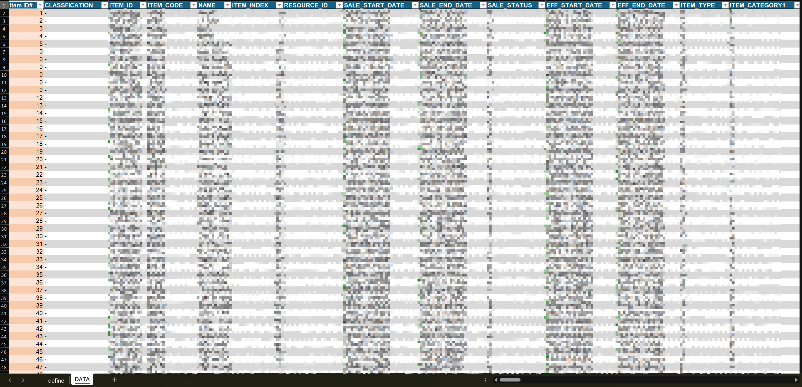
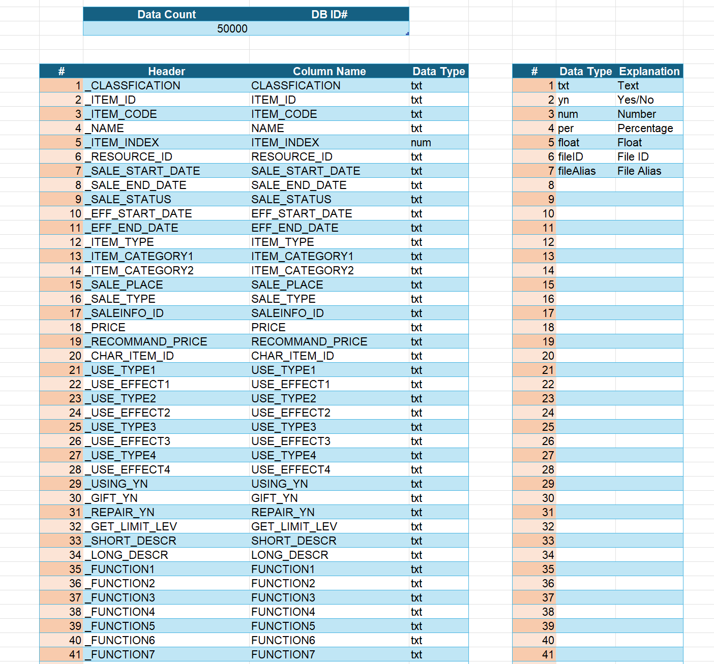
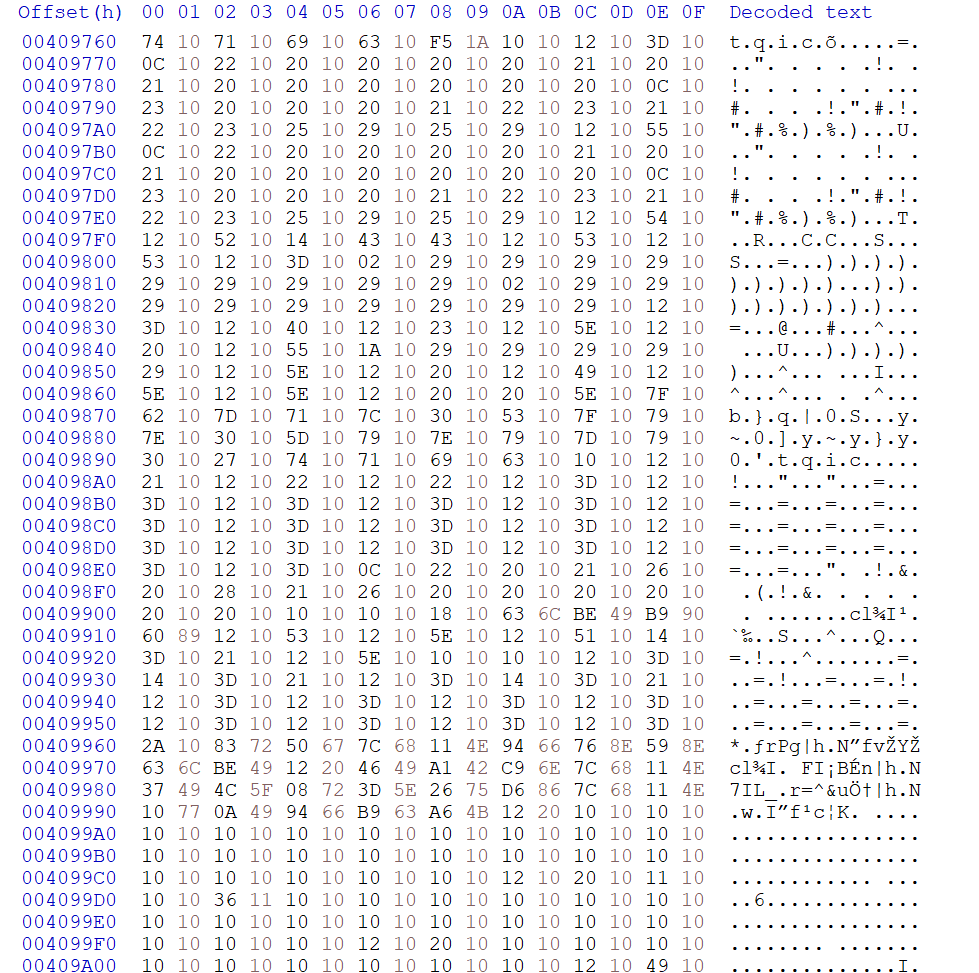
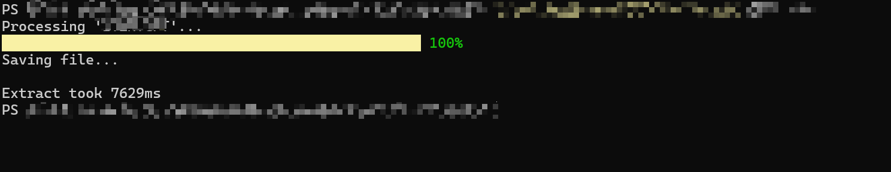

# Game Asset Analysis Tool

## Overview

A C# data processing tool designed to parse proprietary binary resource formats and convert them into structured datasets.

The tool enables analysis of game configuration data and resource structures by exporting parsed data into Excel format.

---

## Key Capabilities

- Parses custom binary resource formats
- Processes 10K+ records per dataset
- Each record contains 100+ columns
- Exports structured Excel files for analysis

---

## Performance Optimization

Initial implementation required approximately 20 seconds to process large datasets.

Through optimization of parsing logic and memory handling:

- Processing time reduced to **7–8 seconds**
- Achieved approximately **2× performance improvement**

---

## Tech Stack

- C#
- .NET
- Excel export libraries

---

## Screenshots

Example Excel output:

Binary format:

Example tool console output:

---

## Selected Demo Code

The `demo-code` folder contains representative examples including:

- binary parsing logic
- data transformation
- Excel export functionality
