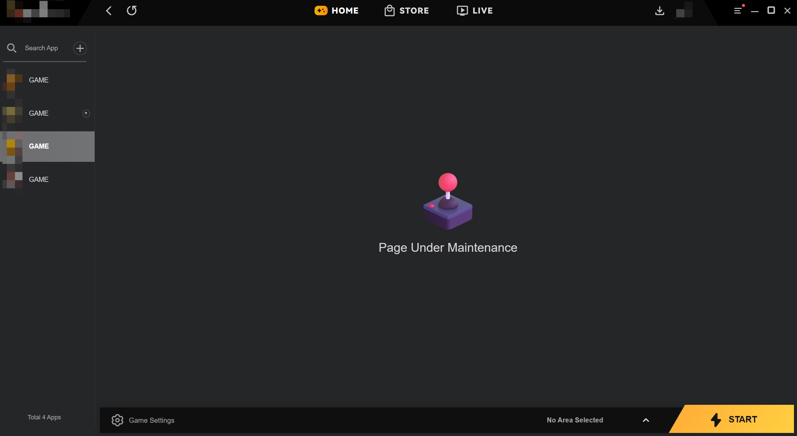
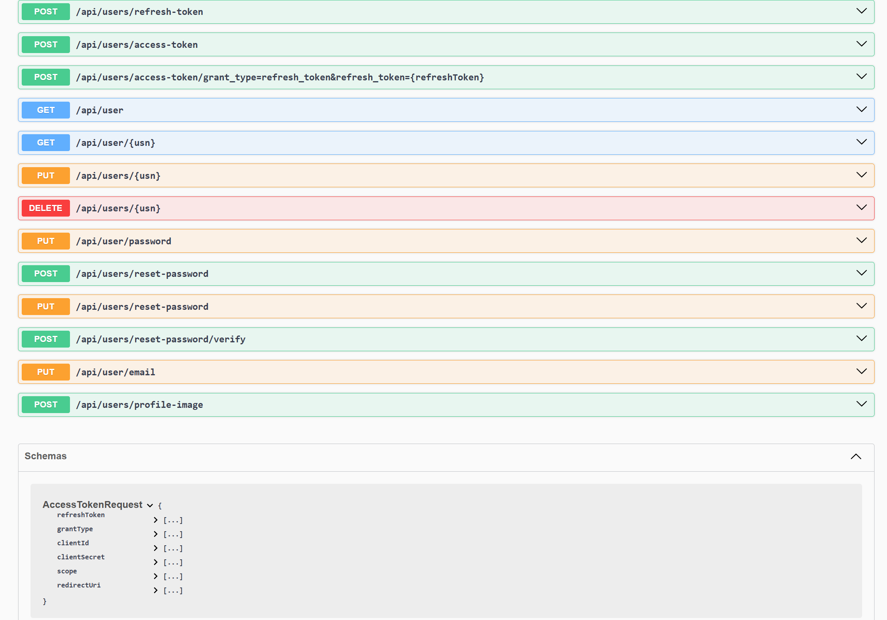

# Game Distribution Platform

## Overview

A desktop game distribution platform inspired by modern digital storefronts.

The platform provides a desktop launcher application with user authentication, game library management, and server region display.

The system combines a Chromium-based UI with backend services built using ASP.NET Core.

---

## System Features

- User authentication and account management
- Game library management
- Region and server display
- Desktop launcher application
- REST API backend services

---

## Architecture

Main components:

- Desktop Client  
  C# application embedding Chromium to render the web-based UI.

- Backend API  
  ASP.NET Core services handling authentication and platform functionality.

- Database Layer  
  SQL Server storing user accounts and platform data.

---

## Tech Stack

- C#
- ASP.NET Core
- SQL Server
- Chromium Embedded Framework
- HTML / CSS / JavaScript

---

## Screenshots

Launcher interface:

User login:

APIs:

---

## Selected Demo Code

The `demo-code` folder includes example implementations of:

- authentication controller
- JWT authentication setup
- sample UI rendering logic
