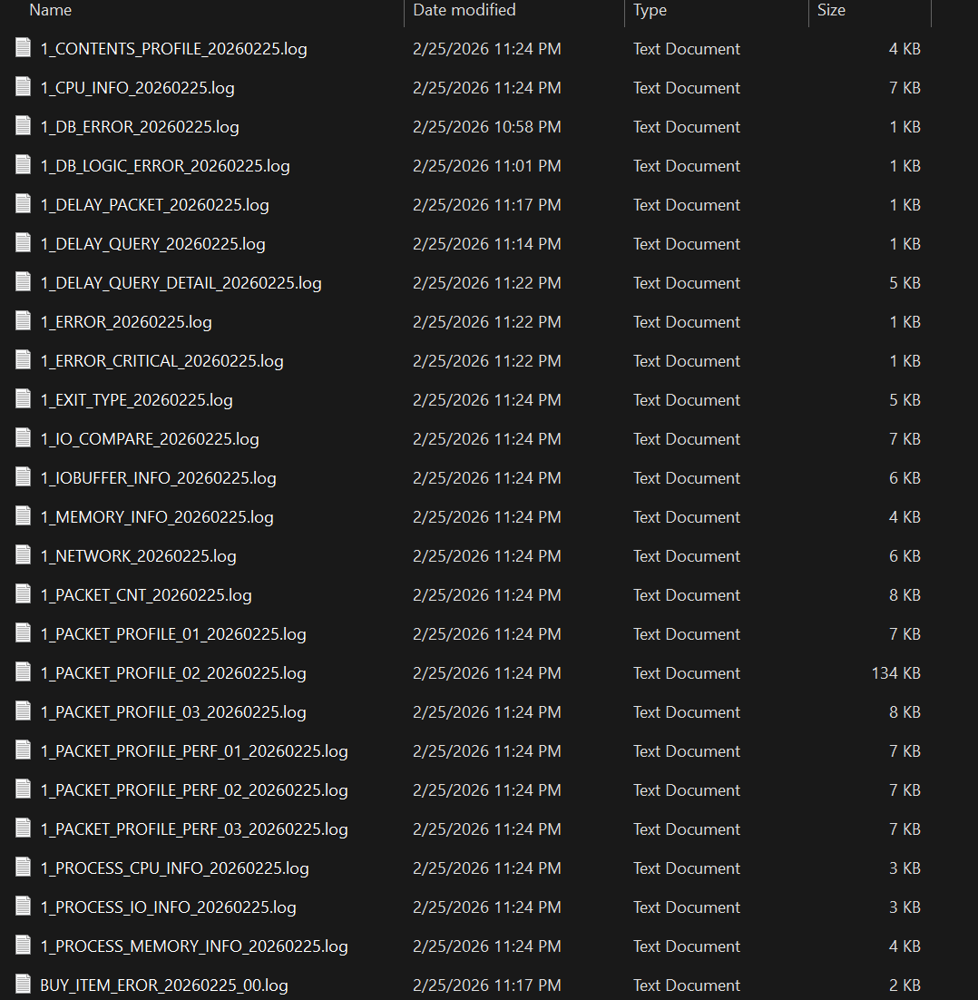
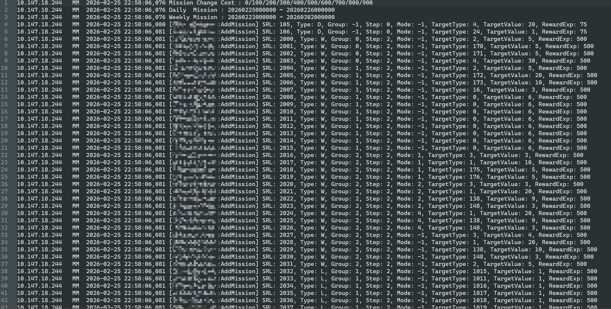
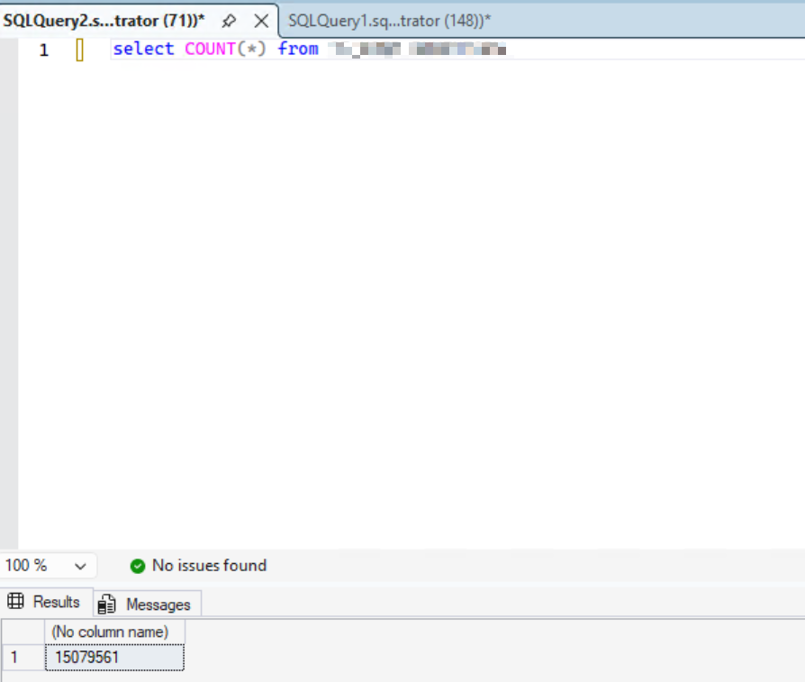
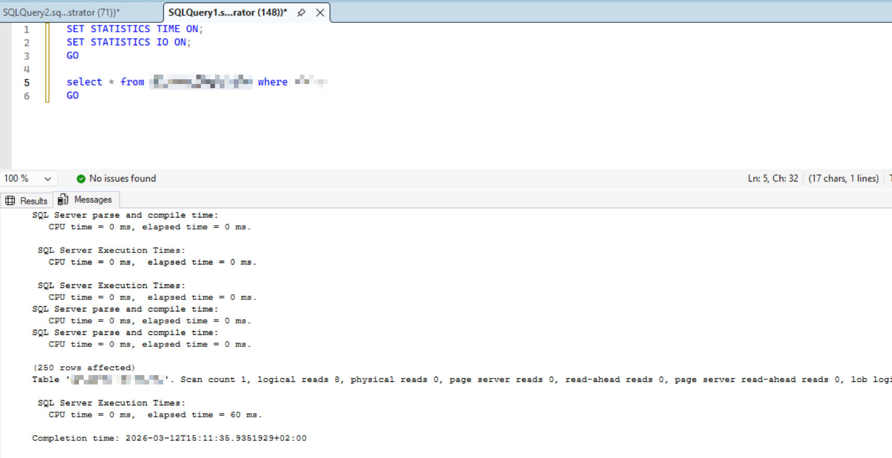

# High-Concurrency Multiplayer Game Backend System

## Overview

A C++ backend system designed to support real-time multiplayer gameplay with high concurrency and persistent state management.

The system implements networking protocol handling, session management, and database-backed game state persistence.

Key characteristics:

- 300K+ lines of C++ code
- Supports 1000+ concurrent players
- Handles 10M+ database records
- Millisecond-level indexed queries

---

## Technical Highlights

- Custom multiplayer networking protocol implementation
- Concurrent session handling for large numbers of connected clients
- Database indexing and query optimization for large-scale datasets
- Server-side validation and game state synchronization

---

## Tech Stack

- C++
- SQL Server
- Custom networking protocol

---

## Screenshots / Logs

Example server runtime output:

Database query:

---

## Selected Demo Code

The `demo-code` folder contains representative code examples illustrating:

- packet parsing
- session management
- database indexing strategy

Full production source code is private.
